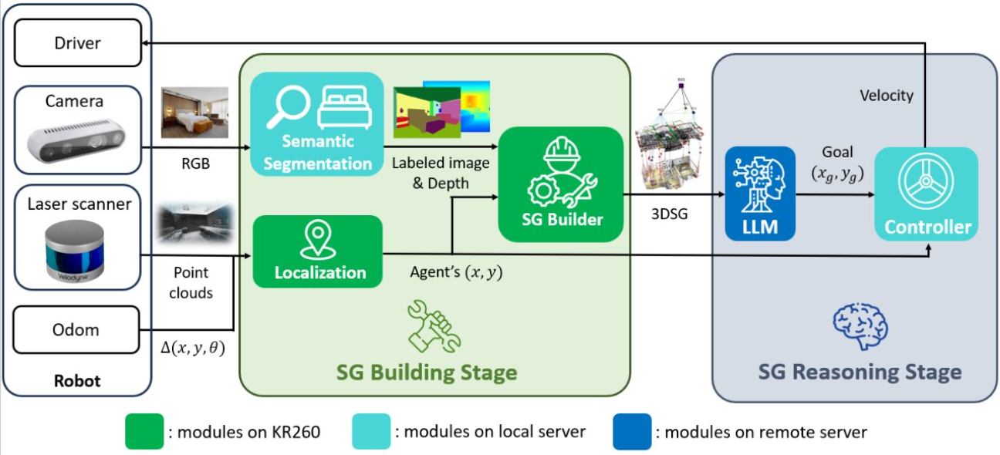
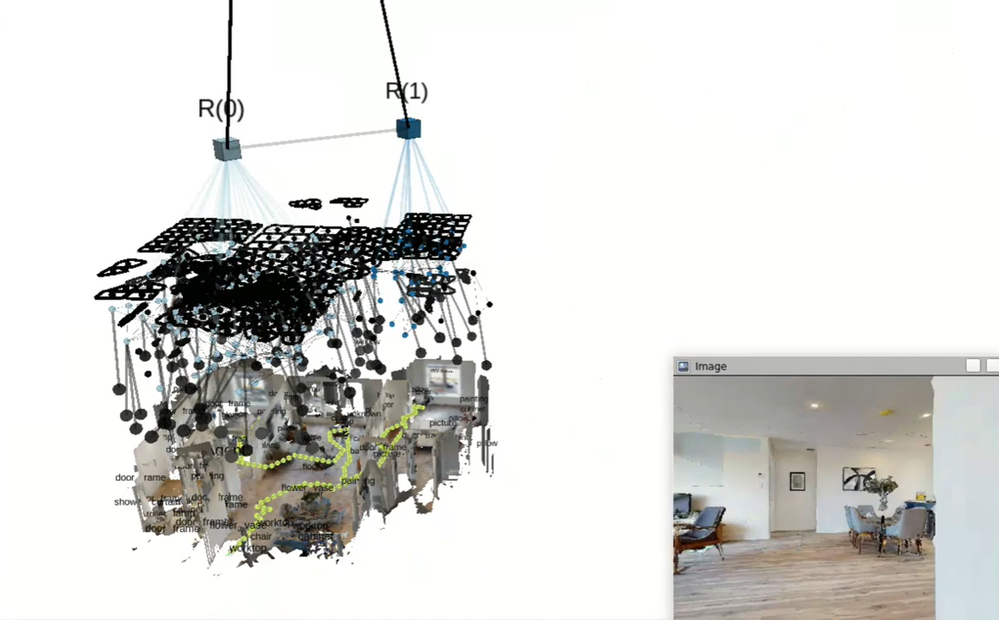

# 🏁 Navigator: Robo-Guide for Your Room!

🌟 A framework for navigation tasks that can build the 3D scene graph in real time and utilize a large language model (LLM) to guide the robot.  

    

> 🏅 This project won third place in the [AMD Pervasive AI Developer Contest 2024 (Robotics AI)](https://www.hackster.io/contests/amd2023#category-1091).

## 🔥 Features

- Real-time construction of a 3D scene graph with open-set segmentation capabilities.
- Outputs the scene graph in a human-readable format.
- Designed with a user-friendly interface.
- Provides integration with ROS (Robot Operating System).

## 📘 Documentation

If you want to test our program, we provide detailed [documentation 📄](https://yuzhong-chen.github.io/LLM-Navigation/), and all the necessary dependency packages are included in Docker. This allows you to set up the environment and start your journey quickly.

## ⚠️ Prerequisites

- Ubuntu
- Git
- Docker and Docker compose
- Visual Studio Code with the DevContainer extension

## 🛠️ Installation

You can find the instructions [here](https://yuzhong-chen.github.io/LLM-Navigation/installation/docker.html).

## ⚡ Quick Start

Please refer to the [Manual](https://yuzhong-chen.github.io/LLM-Navigation/introduction/quick_start.html).

## 📈 Result

    

    

## 🎥 Demo Video

