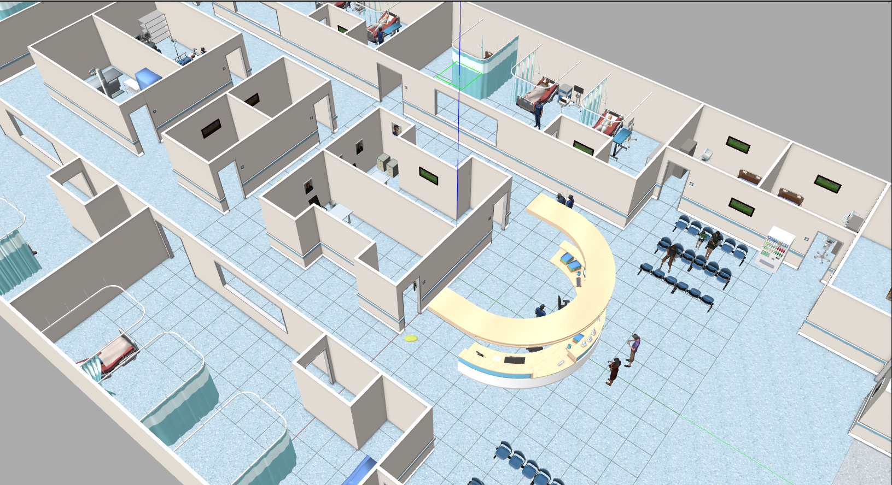

Gazebo World Workspace
=======================

This repository contains several Gazebo worlds, which are valuable for testing robots or agents in both indoor and outdoor environments.

Target worlds
-----------------------

1. ``aws_hospital``

    aws_hospital world

2. ``aws_small_house``

    aws_small_house world

3. ``citysim``

    citysim world

.. note::
    For more target worlds, please refer to the ``README.md`` file in the repository.

Building docker image
-----------------------

1. Clone the repository::

    git clone https://github.com/YuZhong-Chen/LLM-Navigation.git

2. Build the docker image::

    cd LLM-Navigation/gazebo_world_ws/docker
    docker compose pull
    docker compose up -d --build

Building the workspace
-----------------------

1. Attach to the container::

    docker attach ros2-gazebo-world-ws

2. Compile the workspace::

    colcon build --symlink-install
    source /home/ros2-essentials/gazebo_world_ws/install/setup.bash

Run the gazebo worlds
-----------------------

1. Launch the world::
    # Replace <target world> with the name of the world you wish to launch.
    ros2 launch gazebo_launch <target world>.launch.py

Run the gazebo worlds with turtlebot3
-----------------------

1. Launch the world with turtlebot3::
    # Replace <target world> with the name of the world you wish to launch.
    ros2 launch gazebo_launch turtlebot3.launch.py gazebo_world:=<target world>.world

.. note::
    For more details, please refer to the ``README.md`` file in the repository.